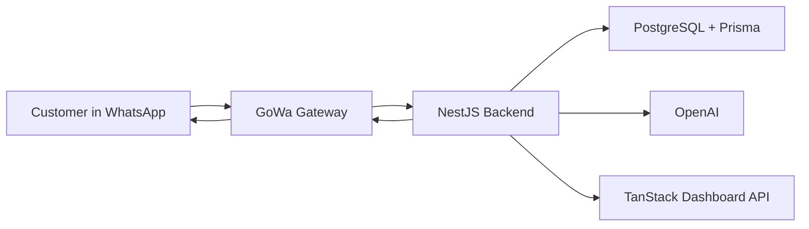

# WhatsApp LLM Sales Chatbot Specification

## 1. Overview

This project is a WhatsApp sales chatbot service that combines structured commerce logic with LLM-powered conversation support.

The chatbot should help customers:

- Discover products
- Ask questions naturally
- Get product recommendations
- Receive pricing calculations
- Handle objections
- Confirm orders
- Receive invoices
- Confirm payments
- Track order progress

The target experience is:

- Conversational like a human sales admin
- Fast and consistent
- Accurate for stock, pricing, and order status
- Flexible enough to answer user questions in natural language

## 2. New Stack

- NestJS as the backend service and orchestration layer
- TanStack Start as the frontend dashboard
- GoWa as the WhatsApp gateway
- PostgreSQL as the main database
- Prisma as the ORM
- OpenAI as the first LLM provider

## 3. Core Architecture

The main runtime flow is:

`WhatsApp Chat -> GoWa -> NestJS -> OpenAI/PostgreSQL -> NestJS -> GoWa -> WhatsApp Chat`

This means:

1. Customer sends a message to your WhatsApp number
2. GoWa receives the message event from the connected WhatsApp session
3. GoWa sends the webhook/event to NestJS
4. NestJS loads conversation context and business data
5. NestJS decides whether the answer should come from:
   - deterministic business logic
   - database lookup
   - OpenAI-assisted response generation
   - a combination of all three
6. NestJS builds a structured reply
7. NestJS calls GoWa outbound message API
8. GoWa sends the message back to the customer in WhatsApp

## 4. Responsibility Split

### GoWa

- Maintain WhatsApp session/device connection
- Receive inbound WhatsApp messages
- Send webhook events to NestJS
- Expose REST API to send outbound messages
- Handle media/document/image sending
- Provide gateway-level delivery integration

### NestJS

- Main business logic service
- Conversation orchestration
- Intent handling
- LLM prompt orchestration
- Product recommendation logic
- Pricing calculation
- Order flow
- Invoice flow
- Payment flow
- Admin API for dashboard

### PostgreSQL + Prisma

- Store all business data
- Store product catalog and stock
- Store chat conversations and message logs
- Store quotes, orders, invoices, and payments
- Store FAQ data and chatbot memory metadata

### OpenAI

- Interpret natural user questions
- Help classify intent
- Generate natural-language replies
- Summarize user needs
- Assist recommendation wording
- Assist objection handling copy

### TanStack Start Dashboard

- Product and stock management
- Conversation monitoring
- Order management
- Invoice and payment operations
- Human escalation and manual overrides
- Analytics and funnel visibility

## 5. Business Process Revamp

The chatbot should act like a sales assistant, not only a menu bot.

The process should be designed around a guided sales journey.

### Stage 1: Greeting and Entry

- Customer sends first message
- System sends welcome message
- Chatbot introduces what it can help with
- Chatbot detects whether the user wants:
  - catalog
  - product question
  - recommendation
  - price calculation
  - direct order

### Stage 2: Understanding User Intent

NestJS should classify the incoming message into one of these main intents:

- greeting
- browse_catalog
- ask_stock
- ask_price
- ask_product_detail
- ask_recommendation
- compare_products
- calculate_price
- objection_or_hesitation
- create_order
- request_invoice
- confirm_payment
- ask_order_status
- request_human_help

OpenAI can assist with flexible intent understanding, but the final mapped action should be controlled by NestJS.

### Stage 3: Product Discovery

If the user wants to browse or search:

- NestJS queries products via Prisma
- NestJS prepares a simple catalog response
- GoWa sends the response as text, media, or supported interactive format

The catalog flow should support:

- all products
- category-based products
- search by name or keyword
- showing stock availability
- showing price

### Stage 4: Conversational Q&A

If the user asks questions like:

- Is item A available?
- What is the difference between A and B?
- Which one is better for my need?
- How much for 20 pcs?

NestJS should:

1. retrieve product data from PostgreSQL
2. retrieve FAQ or policy data if needed
3. call OpenAI with strict context
4. generate a natural answer grounded on real business data

Important rule:

- stock, price, invoice amount, and order status must come from backend data
- OpenAI should explain those values, not invent them

### Stage 5: Recommendation Flow

If the user needs help choosing a product:

- chatbot accepts natural language needs, even if the request is long or unstructured
- OpenAI extracts the user requirements into structured fields
- NestJS runs recommendation logic against real catalog data
- OpenAI helps produce a helpful human-like explanation of the result

Recommendation inputs can include:

- use case
- budget
- quantity
- urgency
- product preference
- technical specifications such as CPU, RAM, GPU, storage, screen size, or other product attributes

Recommendation output should include:

- best-fit product
- optional second option
- why it fits the user
- price range
- stock status
- next action suggestion

### Stage 6: Pricing Calculation

If user asks for total price:

- NestJS pricing service calculates total deterministically
- Inputs:
  - selected product
  - variant
  - quantity
  - discount
  - shipping
  - tax if needed
- OpenAI may help phrase the answer clearly

Example output:

- item total
- discount
- shipping
- grand total
- recommendation to continue order

### Stage 7: Objection Handling

When the user hesitates, the chatbot should try to move the sale forward.

Common objections:

- too expensive
- need faster process
- still confused
- want easier order flow
- need to ask team first

The objection flow should combine:

- predefined business strategy
- product alternatives
- OpenAI-generated natural sales wording

The chatbot should steer the user toward:

- cheaper product
- fastest ready stock option
- easiest checkout path
- admin follow-up when needed

### Stage 8: Order Confirmation

Once the user agrees:

- chatbot confirms product, quantity, price, and customer details
- NestJS creates order draft
- chatbot sends order summary
- chatbot asks for final confirmation

### Stage 9: Invoice Generation

After order confirmation:

- NestJS generates invoice record
- invoice number is created
- invoice file or invoice message is prepared
- GoWa sends invoice to the customer

### Stage 10: Payment Confirmation

Customer can:

- send payment note
- send transfer proof
- send payment reference

NestJS stores the payment confirmation and marks it as pending verification.

### Stage 11: Payment Verification

Payment can be verified by:

- admin from dashboard first
- automation later if integrated with payment channels

Once verified:

- order status becomes paid
- customer receives confirmation message

### Stage 12: Fulfillment Update

When order enters fulfillment:

- order status becomes processing
- customer is notified that the order is being processed

## 6. Recommended System Flow

## Main Conversation Flow

1. Customer sends a WhatsApp message
2. GoWa receives the message
3. GoWa sends webhook payload to NestJS
4. NestJS validates the webhook source
5. NestJS loads or creates:
   - customer
   - conversation
   - message log
6. NestJS detects intent and conversation stage
7. NestJS decides which services are needed:
   - catalog service
   - FAQ service
   - recommendation service
   - pricing service
   - order service
   - invoice service
   - payment service
   - OpenAI response service
8. NestJS composes final response
9. NestJS calls GoWa send-message API
10. GoWa delivers reply to WhatsApp
11. NestJS stores outbound message log

## Catalog Flow

1. User says: "show catalog"
2. GoWa forwards message to NestJS
3. NestJS maps intent to `browse_catalog`
4. NestJS queries active products from PostgreSQL through Prisma
5. NestJS builds catalog response
6. NestJS sends outbound request to GoWa
7. GoWa sends catalog message back to WhatsApp

## Question Answering Flow

1. User asks a natural question
2. NestJS extracts product/entity references
3. NestJS retrieves factual data from database
4. NestJS builds grounded prompt for OpenAI
5. OpenAI returns wording or answer draft
6. NestJS validates final response against business rules
7. NestJS sends final message via GoWa

## Recommendation Flow

1. User asks for recommendation
2. NestJS sends the user message and allowed product context to OpenAI
3. OpenAI extracts structured requirements from the natural language request
4. NestJS saves recommendation session
5. NestJS ranks matching products from PostgreSQL through Prisma
6. If no exact match exists, NestJS selects the closest valid alternatives
7. OpenAI generates conversational explanation for the recommended result
8. NestJS sends recommendation to user

## Example Recommendation Scenario

User message:

`I want a PC for design, 32GB RAM, RTX 4060, and my budget is 15 juta.`

Recommended handling:

1. GoWa sends the message to NestJS
2. NestJS calls OpenAI to extract the requirement
3. OpenAI returns a structured interpretation such as:

```json
{
  "intent": "recommend_product",
  "category": "pc",
  "requirements": {
    "use_case": "design",
    "ram_min_gb": 32,
    "gpu": "RTX 4060",
    "budget_max": 15000000
  }
}
```

4. NestJS queries products that match or closely match those requirements
5. NestJS validates stock, price, and product availability
6. OpenAI writes a user-friendly recommendation based on the real query result
7. GoWa sends the recommendation back to WhatsApp

This is the recommended recommendation architecture:

- OpenAI understands the need
- NestJS performs the real product search
- PostgreSQL is the source of truth
- OpenAI explains the result naturally

## Pricing Flow

1. User asks for total price
2. NestJS loads pricing data
3. NestJS computes total internally
4. OpenAI formats a friendly explanation if needed
5. GoWa sends the pricing response

## Order-to-Payment Flow

1. User confirms item
2. NestJS creates order
3. NestJS generates invoice
4. GoWa sends invoice
5. User sends payment confirmation
6. NestJS stores payment confirmation
7. Admin verifies payment in dashboard
8. NestJS updates order status
9. GoWa sends paid and processing updates

## 7. LLM Integration Design

The chatbot should not be pure LLM and should not let the model control core transactions.

Use OpenAI for:

- intent assistance
- natural reply generation
- question answering based on provided context
- requirement extraction from natural language
- recommendation explanation
- objection handling language
- summarizing customer needs

Do not use OpenAI as the source of truth for:

- stock quantity
- price
- final quotation value
- invoice totals
- payment verification result
- order status updates

## Recommended LLM Pattern

Use a retrieval-plus-rules approach:

1. NestJS receives user message
2. NestJS retrieves business facts from database
3. NestJS creates structured prompt with:
   - user message
   - customer context
   - conversation stage
   - allowed products
   - stock and pricing facts
   - business rules
4. OpenAI returns a draft response or structured classification
5. NestJS validates and formats final output

## Suggested AI Safety Rules

- Never allow model to invent stock or price
- Reject unsupported claims
- Fallback to human/admin when confidence is low
- Keep prompts grounded by passing only relevant business data
- Log prompts and model outputs for debugging in development

## 8. Suggested NestJS Modules

- `auth`
- `customers`
- `conversations`
- `messages`
- `catalog`
- `inventory`
- `faq`
- `intents`
- `recommendations`
- `pricing`
- `orders`
- `invoices`
- `payments`
- `llm`
- `gowa`
- `webhooks`
- `dashboard`
- `audit-logs`

## 9. Suggested Database Model

### `customers`

- `id`
- `name`
- `phoneNumber`
- `email`
- `notes`
- `createdAt`
- `updatedAt`

### `conversations`

- `id`
- `customerId`
- `channel`
- `status`
- `stage`
- `lastInboundAt`
- `lastOutboundAt`
- `assignedAdminId`
- `createdAt`
- `updatedAt`

### `messages`

- `id`
- `conversationId`
- `direction`
- `messageType`
- `content`
- `rawPayload`
- `gatewayMessageId`
- `createdAt`

### `products`

- `id`
- `sku`
- `name`
- `description`
- `category`
- `price`
- `stockQty`
- `imageUrl`
- `isActive`
- `createdAt`
- `updatedAt`

### `productVariants`

- `id`
- `productId`
- `name`
- `sku`
- `price`
- `stockQty`

### `recommendationSessions`

- `id`
- `customerId`
- `conversationId`
- `needSummary`
- `budget`
- `urgency`
- `preferredCategory`
- `recommendedResult`
- `createdAt`

### `quotes`

- `id`
- `customerId`
- `conversationId`
- `subtotal`
- `discountAmount`
- `shippingAmount`
- `taxAmount`
- `totalAmount`
- `status`
- `createdAt`

### `orders`

- `id`
- `orderNumber`
- `customerId`
- `conversationId`
- `quoteId`
- `status`
- `subtotal`
- `discountAmount`
- `shippingAmount`
- `taxAmount`
- `totalAmount`
- `createdAt`
- `updatedAt`

### `orderItems`

- `id`
- `orderId`
- `productId`
- `productNameSnapshot`
- `unitPrice`
- `quantity`
- `lineTotal`

### `invoices`

- `id`
- `invoiceNumber`
- `orderId`
- `customerId`
- `status`
- `issuedAt`
- `dueAt`
- `subtotal`
- `totalAmount`
- `fileUrl`

### `payments`

- `id`
- `orderId`
- `invoiceId`
- `customerId`
- `amount`
- `paymentMethod`
- `referenceNumber`
- `proofUrl`
- `status`
- `paidAt`
- `verifiedAt`
- `verifiedBy`

### `faqEntries`

- `id`
- `question`
- `answer`
- `category`
- `isActive`

### `llmLogs`

- `id`
- `conversationId`
- `messageId`
- `model`
- `promptSummary`
- `responseSummary`
- `createdAt`

## 10. API and Integration Flow

## GoWa to NestJS

Suggested webhook entrypoints:

- `POST /webhooks/gowa/messages`
- `POST /webhooks/gowa/status`

GoWa should send inbound message events to NestJS.

## NestJS to GoWa

Suggested outbound endpoints through GoWa:

- send text message
- send image
- send document
- send product/media response

Wrap this in a dedicated `gowa` service inside NestJS.

## NestJS Internal Services

- `intent service`
- `conversation service`
- `catalog service`
- `recommendation service`
- `pricing service`
- `order service`
- `invoice service`
- `payment service`
- `llm orchestration service`

## 11. Frontend Dashboard Scope

The dashboard should support operations and human takeover.

### Main Pages

- login
- overview
- conversations
- customers
- products
- stock
- quotes
- orders
- invoices
- payments
- settings

### Main Actions

- review active conversations
- take over from chatbot
- edit product stock and pricing
- verify payments
- update order status
- resend invoice
- inspect chatbot reasoning and logs in dev mode

## 12. Recommended Development Phases

### Phase 1: Chat Foundation

- connect GoWa to NestJS webhook
- persist inbound and outbound messages
- build conversation state tracking
- build welcome flow

### Phase 2: Commerce Knowledge

- catalog API
- stock lookup
- FAQ
- product detail flow

### Phase 3: LLM Layer

- OpenAI integration
- grounded Q&A
- intent assistance
- recommendation explanation
- objection handling responses

### Phase 4: Transaction Flow

- pricing calculation
- order confirmation
- invoice generation
- payment confirmation

### Phase 5: Operations Dashboard

- TanStack dashboard
- payment verification
- order processing updates
- chat monitoring

## 13. MVP Recommendation

The fastest useful MVP should include:

- WhatsApp inbound/outbound integration with GoWa
- welcome message
- product catalog
- stock and price Q&A
- OpenAI-powered natural replies with grounded data
- recommendation flow
- pricing calculation
- order creation
- invoice sending
- manual payment verification from dashboard

## 14. Production Recommendations

- Add Redis + BullMQ for background jobs and retries
- Add object storage for invoice files and payment proofs
- Add webhook signature verification and audit logs
- Add rate limiting and admin role separation
- Add prompt/version logging for LLM debugging
- Add fallback to human admin if model confidence is low

## 15. Key Decisions

- whether GoWa will be single-account or multi-account
- whether invoice is text-only or PDF
- whether payment proof upload is supported in chat
- whether chatbot can fully create order without human approval
- whether recommendation is rules-only or hybrid rules + LLM
- whether admin can jump into live chat from dashboard

## 16. Proposed High-Level Diagram



## 17. Summary

This revamp changes the system from a gateway-driven automation flow into a backend-centered LLM commerce platform.

The main pattern is:

- GoWa handles WhatsApp transport
- NestJS is the main brain
- PostgreSQL is the source of truth
- Prisma manages data access
- OpenAI adds flexible conversation intelligence
- TanStack Start provides admin visibility and control

This is a stronger structure for an LLM chatbot service because it keeps business-critical logic in NestJS while still allowing the conversation to feel natural and adaptive.

---

Reference used for gateway capabilities: [GoWa repository](https://github.com/aldinokemal/go-whatsapp-web-multidevice)
